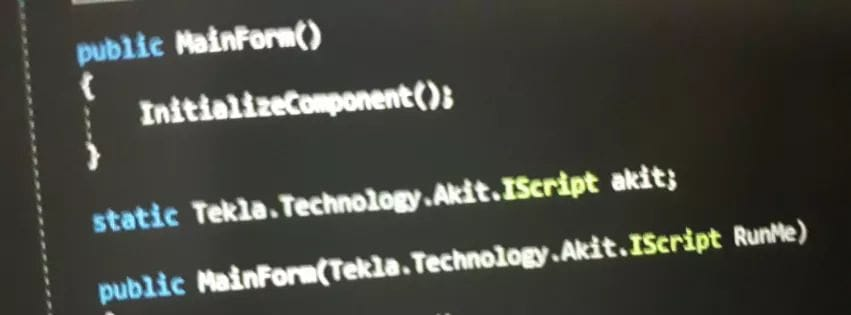

## So what is a macro? 

The definition of the word macro is "a single instruction that expands automatically into a set of instructions to perform a particular task".

## Hit record or write it from scratch?

There are two methods for creating a macro for use in Tekla Structures, which are:

- recorded macro
- written macro

Recorded macros are as they sound - recorded. Tekla Structures can record your actions within its menus & dialogs and generate the associated code in a .cs file. These don't use the API directly, instead the menus & dialogs act as a middle man to interact with objects.

Mostly created from scratch, written macros interact with objects directly using the API. I prefer this method because in my opinion the dialogs are cumbersome.
 
In some cases a combination of the two is the only option, like when the API doesn't cater for a specific task and can only be achieved via a recorded macro.

## To WinForm or not to WinForm 

When planning your macro, you need to decide whether a form is needed. Oftentimes, a macro is simple enough that a form isn't required, and any information can be conveyed to the user via fhe status bar in Tekla Structures.

## Are you LinkedIn?

In addition to my other connected accounts, I have now created a [LinkedIn page](https://www.linkedin.com/company/teklanology), so feel free to say hi.